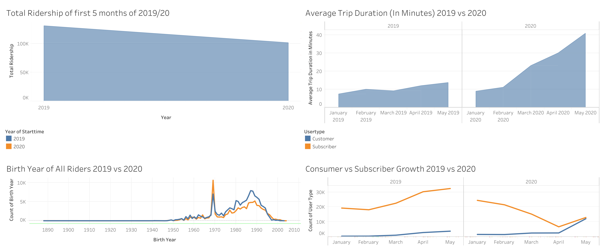

# Citi-Bike-Tableau-Analytics
Visualization of New York's Citi Bike Program utilizing Tableau

## How to Recreate
1. Git Clone this Repository
2. Run "Cleaning Up Data.ipynb"
3. Load the Datasets created from Step 2 onto Tableau 
4. Create your own visualizations! 

## Interesting Facts
By comparing directly the first 5 months of 2019 and 2020, we are able to see interesting trends that emerged as a consequence of COVID-19. 
* Total Ridership is down
* The demographics of who uses the Bike Program has changed, older people are using it more often. 
* Trip Duration has increased considerably
* Customers(people who purchase 24-hour pass or 3-day pass user) are driving ridership numbers in 2020

## Visualization of Dashboard 

